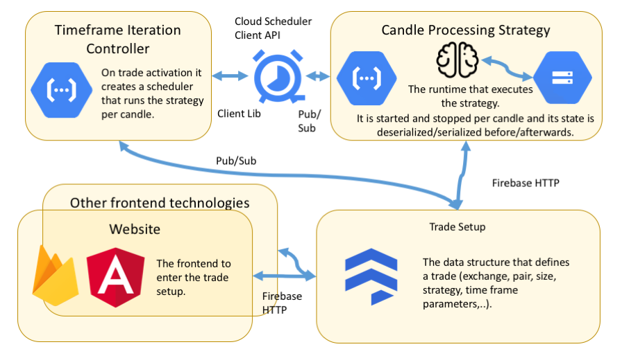

# cryptotrader
This project is work in progress.

The goal is to run pluggable trading strategies in the cloud. An example of such a strategy is the trailing stop-loss strategy implemented here that can be run after a long trade at Binance.

The ParabolicSL used in the code is an adapted ParabolicSAR that can start with a custom initial stop-loss depending on the TA of the individual long trade.

`TestTrailingStopLossRestore` is the test that shows the latest status of the project. You can read the workflow below to understand what it does.

## Risks
- The automatic tests cover currently only one single backtest of the trailing stop-loss on a single pair and a single exchange (Binance).
- As the runtime needs to be restarted for every candle the state is serialized before stopping and deserialized after starting with a candle to let the state survive between the runs. But the underlaying frameworks are not supposed to work like that and don't support persisting or reloading its state. If not all data is catched to be (de-)serialized there is a risk that information can get lost between the runs. You find more information about that in the workflow section. 



## The workflow
1. The frontend is planned to run on Firebase Hosting with Angular as the frontend framework. But it could potentially be any other frontend technology as long as it can work with Firestore.
2. It is supposed to CRUD Trade Setup documents in Firestore. They contain data like the trading pair, the position size or the timeframe needed by the stop-loss strategy.
3. The Timeframe iteration controller is a Google Cloud function. It is supposed to [run when Firestore documents have been added/changed](https://firebase.google.com/docs/functions/firestore-events). 
E.g. if it identifies a new one it should configure a Google Cloud Scheduler to run the Cryptotrader runtime as a Google Cloud Function with the trailing stop-loss strategy depending on the timeframe in the trade setup as a cron job.
4. In the specified timeframe intervals the Cryptotrader runtime will load the latest state of Strategy from the Google Cloud Storage, run the Strategy and store the new state in the Cloud Storage again for the next run to use. 
The state is stored as a plain JSON file as the internal dict data structures are simple to read and write in that format compared to the custom Firestore data structure. This (de-)serialization logic has also been implemented for the local
file system. It is tested in `TestTrailingStopLossRestore`.
The strategy will also need to read the trade setup in Firestore to make the actual trades and it needs to change a property to instruct the Timeframe iteration controller to end the cron job. 

## Cryptotrader runtime
It is based on great frameworks like [Backtrader](https://backtrader.com/docu), [CCXT](https://github.com/ccxt/ccxt), and Ed Bartosh's, Dave Vallance's and my work on [bt-ccxt-store](https://github.com/Dave-Vallance/bt-ccxt-store) which combines Backtrader and CCXT.

## Requirements
Python 3

## Installation
```
virtualenv --python python3 env
source env/bin/activate
pip3 install -r requirements.txt
```

## Run
``` 
./backtestPsarStopLoss.sh
```

## Exit virtualenv
``` 
deactivate
```
